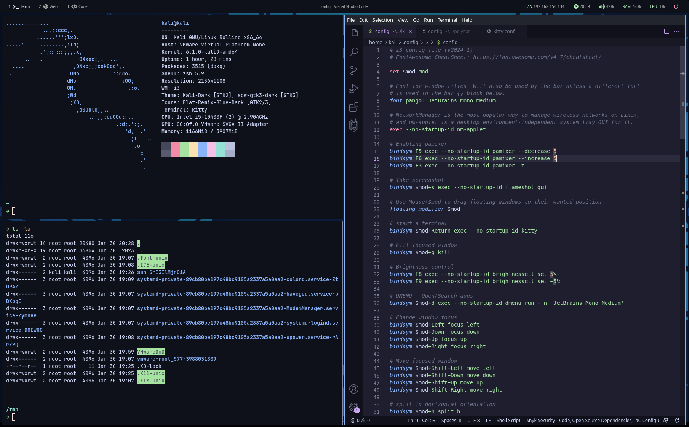

# kali-i3wm-gaps
From Kali you can install i3-gaps: `sudo apt install i3-gaps`  
After that, login with i3 environment and install the dependencies before the dotfiles.

# Dependencies
## Apps
- polybar (Top bar) `sudo apt install polybar`
- kitty (Terminal) `sudo apt install kitty`
- Flameshot (Screenshot) `sudo apt install flameshot`
- Nitrogen `sudo apt install nitrogen`

## Fonts
- JetBrains Mono
- [Font Awesome Solid](https://github.com/FortAwesome/Font-Awesome/blob/master/webfonts/fa-solid-900.ttf)

## Super Shortcuts
Super = Left-ALT
- Super + Enter = Terminal
- Super + d = Dmenu
- Super + f = Fullscreen
- Super + e = Thunar
- Super + 1-7 = Workspaces
- Super + Shift + 1-7 = Move window to workspace number
- Super + q = Close window
- Super + Shift + Space = Floating window

# Screenshot
